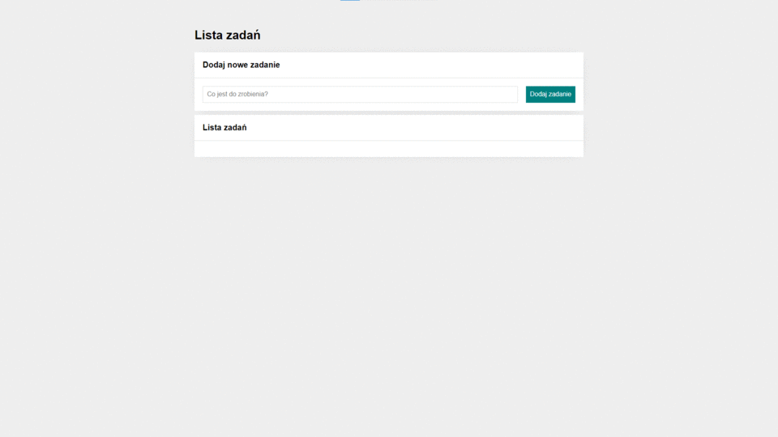

# To-do-list

## Link

https://pawelsi.github.io/To-do-list/

## How to use To-do list

This is my third project on frontend dev course. This time in my new web you can create your own To-do list. 
First write down any task you have to do, click "Dodaj zadanie" and you will see your task on the list.
When you will do, click a green square - it will show you checkark and this task will be crossed out. 
After all you can click a red square - it removes task.

## Technologies used:

- HTML
- CSS
- JavaScript
- Normalize
- BEM Convention
- GIT

## Author

Paweł Sitkowski
